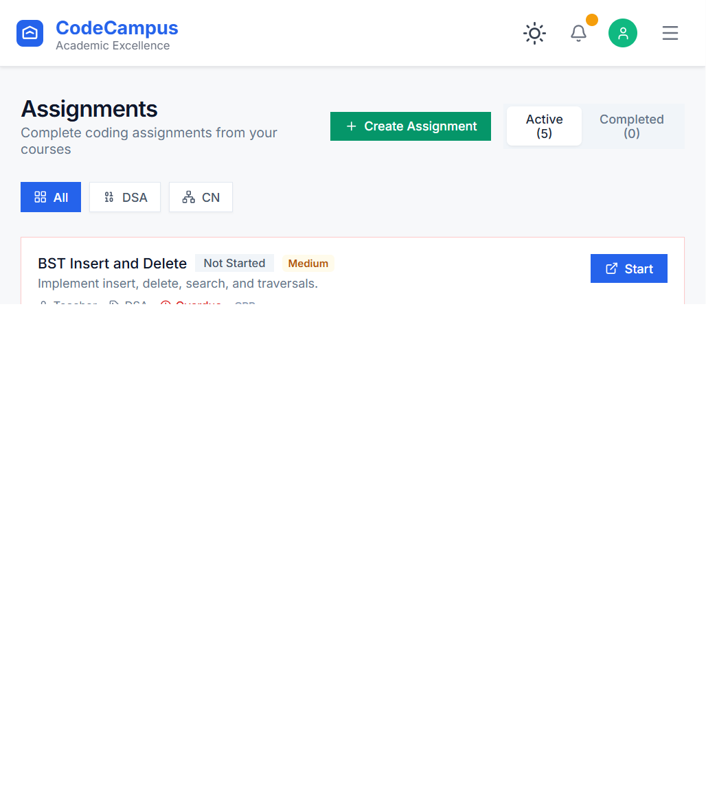
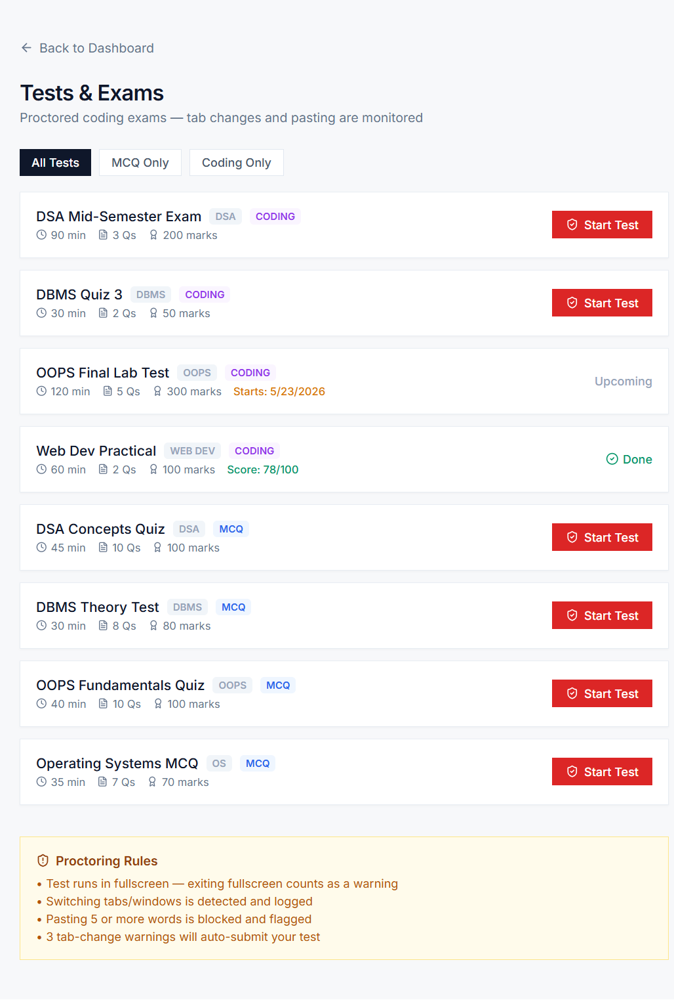
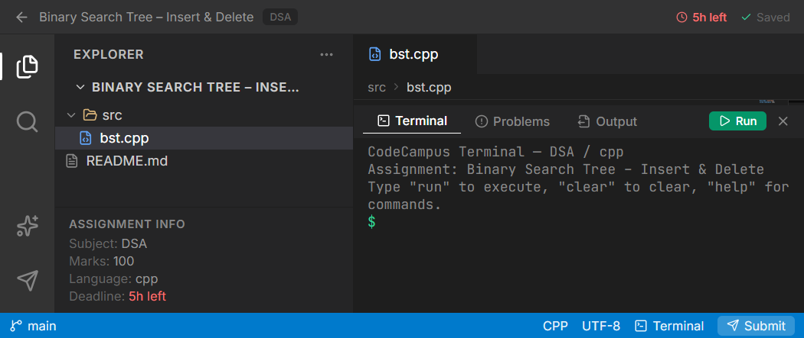
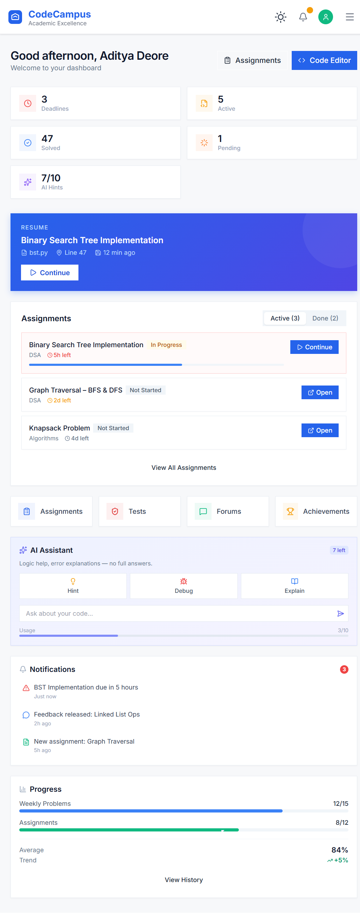
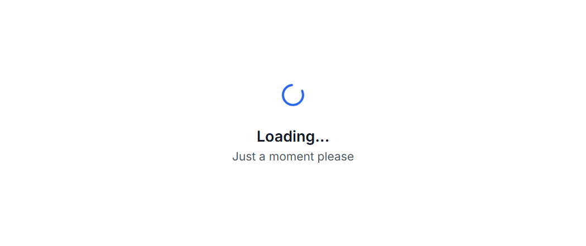
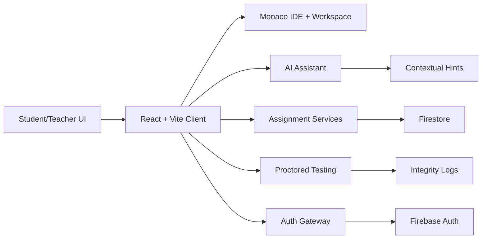

<p align="center">
  
</p>

<h1 align="center">CodeCampus</h1>

<p align="center">
  A comprehensive coding education platform for computer science students, featuring a VS Code-style IDE, proctored testing, and real-world problem solving.
</p>

<p align="center">
  <a href="#product-tour">Product Tour</a> ·
  <a href="#features">Features</a> ·
  <a href="#quick-start">Quick Start</a> ·
  <a href="#project-structure">Project Structure</a> ·
  <a href="#deployment">Deployment</a>
</p>

<p align="center">
  
  
  
  
  
  
</p>

## Product Tour

<p align="center">
  
</p>

<p align="center">
  
</p>

<p align="center">
  
</p>

<p align="center">
  
</p>

<p align="center">
  
</p>

## IDE Walkthrough (Animated)

<p align="center">
  
</p>

## Real UI Screenshots

<p align="center">
  
  <br />
  <em>Assignments hub</em>
</p>

<p align="center">
  
  <br />
  <em>Proctored test environment</em>
</p>

<p align="center">
  
  <br />
  <em>VS Code-style assignment workspace</em>
</p>

<p align="center">
  
  <br />
  <em>Student dashboard</em>
</p>

<p align="center">
  
  <br />
  <em>Achievement center</em>
</p>

## 🚀 Features

### 📝 **VS Code-Style Workspace**
- **Activity Bar** - Quick access to file explorer, search, and AI assistant
- **Multi-File Editing** - Tabbed interface with Monaco Editor integration
- **File Tree Navigation** - Browse and manage assignment files (Python, SQL, Java, JavaScript)
- **Integrated Terminal** - Execute code with real-time output and command support
- **AI Chat Assistant** - Context-aware hints and debugging help (no direct solutions)
- **Search Functionality** - Find text across all assignment files
- **Breadcrumb Navigation** - Track current file location

### 📚 **Assignments System**
- **Subject-Based Organization** - Filter by DSA, DBMS, Web Dev, OOP, Algorithms, etc.
- **Deadline Tracking** - Visual countdown with color-coded urgency
- **Multi-File Projects** - Work with src/, tests/, and config files
- **Code Execution** - Run JavaScript, Python (simulated), and SQL directly in browser
- **Paste Detection** - Academic integrity monitoring (10+ word threshold)
- **Auto-Save** - Changes saved automatically while coding

### 🔒 **Proctored Test Environment**
- **Fullscreen Enforcement** - Auto-warnings when exiting fullscreen
- **Tab Switch Detection** - Monitors focus changes (3 warnings = auto-submit)
- **Time Management** - Countdown timer with auto-submit on expiry
- **Question Navigation** - Skip, mark for review, and track progress
- **Secure Submission** - Lock-in mechanism after deadline

### 🎓 **Learning Features**
- **Problem History** - Track all attempted problems and submissions
- **Achievement Center** - Leaderboards, badges, and gamification
- **Campus Forums** - Discuss topics, ask questions, and share knowledge
- **Project Showcase** - Build and display your portfolio

## Architecture At A Glance



## 💻 Tech Stack

- **React 18** - Modern hooks, Suspense, and code splitting
- **Vite 5** - Lightning-fast dev server and optimized builds
- **Monaco Editor** - Industry-standard code editor (VS Code engine)
- **TailwindCSS** - Utility-first CSS with custom dark theme
- **Firebase** - Authentication and real-time features
- **Firestore** - Database and backend services
- **React Router 6** - Client-side routing with protected routes

## ⚡ Quick Start

### Prerequisites
- Node.js 16+ and npm
- A Firebase project (free tier works!)

### Setup Instructions

1. **Clone the repository**
   ```bash
   git clone https://github.com/AdityaxDeore/codecampus.git
   cd codecampus
   ```

2. **Install dependencies**
   ```bash
   npm install
   ```

3. **Configure Firebase** ⚠️ **IMPORTANT**

   Without this step, you'll see a white screen!

   ```bash
   # Copy the environment template
   cp .env.example .env  # Mac/Linux
   copy .env.example .env  # Windows
   ```

   Then edit `.env` and add your Firebase credentials:
   ```env
   VITE_FIREBASE_API_KEY=your-actual-api-key
   VITE_FIREBASE_AUTH_DOMAIN=your-project.firebaseapp.com
   VITE_FIREBASE_PROJECT_ID=your-project-id
   VITE_FIREBASE_APP_ID=your-app-id
   ```

   **Where to get these values:**
   - Go to [Firebase Console](https://console.firebase.google.com)
   - Create a project (or select existing)
   - Go to **Project Settings** → **General** → **Your apps**
   - Click **Web app** → **Config** → Copy the values

4. **Start the development server**
   ```bash
   npm start
   ```

   The app will open at `http://localhost:4028`

### Troubleshooting

**White screen after cloning?**
- Make sure you created the `.env` file with valid Firebase credentials
- Check the browser console for specific error messages
- Restart the dev server after adding credentials

**Build fails?**
- Delete `node_modules` and `package-lock.json`, then run `npm install` again
- Make sure you're using Node.js 16+

## 🛠️ Development

```bash
# Install dependencies
npm install

# Start development server (runs on http://localhost:4028)
npm start

# Build for production
npm run build

# Preview production build
npm run preview
```

### Quick Navigation

Once the server is running, access these routes:

- `/` - Homepage
- `/login` - Authentication
- `/student-dashboard` - Student dashboard
- `/assignments` - Assignment listing
- `/assignment-workspace?id=a1` - VS Code workspace (BST assignment)
- `/assignment-workspace?id=a2` - Graph traversal assignment
- `/assignment-workspace?id=a7` - SQL normalization assignment
- `/test` - Proctored test environment
- `/achievement-center` - Leaderboards and achievements
- `/campus-forums` - Discussion forums

## 📁 Project Structure

```
codecampus/
├── src/
│   ├── components/            # Reusable UI components
│   │   ├── ui/               # Button, Input, Header, etc.
│   │   ├── AppIcon.jsx       # Icon wrapper component
│   │   ├── ErrorBoundary.jsx # Error handling
│   │   └── ProtectedRoute.jsx # Auth guards
│   ├── pages/
│   │   ├── assignment-workspace/  # VS Code-style IDE
│   │   ├── assignments/           # Assignment listing page
│   │   ├── test/                  # Proctored test environment
│   │   ├── student-dashboard/     # Main student dashboard
│   │   ├── achievement-center/    # Leaderboards and badges
│   │   ├── campus-forums/         # Discussion forums
│   │   ├── problem-workspace/     # Problem solving IDE
│   │   ├── problems/              # Problem catalog
│   │   ├── homepage/              # Landing page
│   │   └── login/                 # Authentication
│   ├── shared/               # Shared components and data
│   ├── lib/                  # Firebase config and utilities
│   ├── contexts/             # React Context (Dark mode, etc.)
│   ├── hooks                # Custom React hooks
│   ├── utils/                # Helper functions
│   └── styles/               # Global CSS and Tailwind
├── public/                   # Static assets
├── docs/                     # Documentation
│   ├── graphics/             # README visuals
│   └── screenshots/          # README screenshots
└── vite.config.mjs           # Vite configuration
```

## Code Execution Engines

The platform supports in-browser code execution for multiple languages:

### JavaScript
- **Sandboxed Execution** - Runs in isolated Function context
- **Console Capture** - Intercepts log, error, warn, and info
- **Error Handling** - Displays runtime errors with stack traces

### Python (Simulated)
- **Pattern Matching** - Analyzes print() statements
- **TODO Detection** - Warns about unimplemented code sections
- **Output Simulation** - Mimics Python console behavior

### SQL (Simulated)
- **Statement Parsing** - Recognizes SELECT, CREATE, INSERT, ALTER, DROP
- **Query Feedback** - Provides execution status for each statement
- **Multi-Statement Support** - Handles semicolon-separated queries

## 🎮 Academic Integrity Features

- **Copy-Paste Monitoring** - Flags pastes over 10 words
- **Timestamp Tracking** - Records all paste events with word count
- **Instructor Dashboard** - Review flagged submissions (planned)
- **Tab Switch Alerts** - Monitors focus during proctored tests
- **Fullscreen Lock** - Enforces secure testing environment

## 🧠 AI Assistant

- **Context-Aware** - Understands current assignment and language
- **Hint-Based** - Guides students without giving direct solutions
- **Debugging Help** - Analyzes errors and suggests fixes
- **Quick Actions** - Pre-built prompts for hints, debugging, and explanations

## Performance

- Route-based code splitting for optimal loading
- Vendor chunk optimization
- Lazy-loaded components with Suspense
- Optimized bundle size with manual chunks

## 🧩 Adding Routes

To add new routes to the application, update the `Routes.jsx` file:

```jsx
import { useRoutes } from "react-router-dom";
import HomePage from "pages/HomePage";
import AboutPage from "pages/AboutPage";

const ProjectRoutes = () => {
  let element = useRoutes([
    { path: "/", element: <HomePage /> },
    { path: "/about", element: <AboutPage /> },
    // Add more routes as needed
  ]);

  return element;
};
```

## ⌨️ Keyboard Shortcuts (Workspace)

| Shortcut | Action |
|----------|--------|
| `Ctrl/Cmd + S` | Save current file |
| `Ctrl/Cmd + B` | Toggle sidebar |
| `Ctrl/Cmd + `` ` `` | Toggle terminal |

## 🖥️ Terminal Commands

Available in the integrated terminal:

```bash
run        # Execute current file
clear      # Clear terminal history
ls         # List all files in project
cat <file> # Display file contents
help       # Show available commands
```

## 🎨 Styling

This project uses Tailwind CSS for styling. The configuration includes:

- Forms plugin for form styling
- Typography plugin for text styling
- Aspect ratio plugin for responsive elements
- Container queries for component-specific responsive design
- Fluid typography for responsive text
- Animation utilities

## 📱 Responsive Design

The app is built with responsive design using Tailwind CSS breakpoints.

## 📦 Deployment

Build the application for production:

```bash
npm run build
```

### Vercel Deploy Panel

<p align="center">
  
  
  
  
</p>

**Environment Validation Tips**
- Confirm all `VITE_FIREBASE_*` variables exist in Vercel before the first build.
- If deploying under a subpath, set `VITE_BASE_PATH=/your-subpath/` in Vercel.
- After deploy, verify `/login`, `/assignments`, and `/achievement-center` load without refresh errors.

## 📄 License

MIT License - see LICENSE file for details.

## Root Files

```
├── index.html          # HTML template
├── package.json        # Project dependencies and scripts
├── tailwind.config.js  # Tailwind CSS configuration
└── vite.config.js      # Vite configuration
```

Project by -
Aditya Deore

cd /home/adityadeore/Documents/CODECAMPUS/codecampus && npm start
