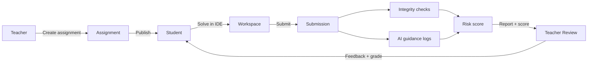
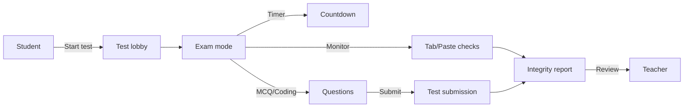
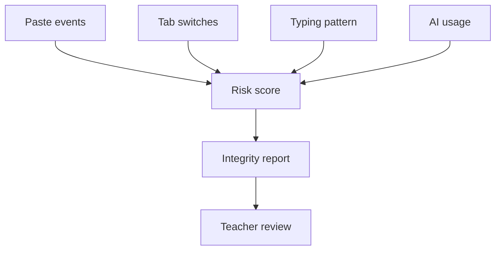

# CodeCampus — PPT Diagrams (Mermaid)

Paste these Mermaid diagrams into any Mermaid renderer (or supported tools) and export as PNG/SVG for PPT.

## Diagram 1: Teacher → Student → Review Cycle

## Diagram 2: Proctored Test Flow

## Diagram 3: Integrity Signal Sources

